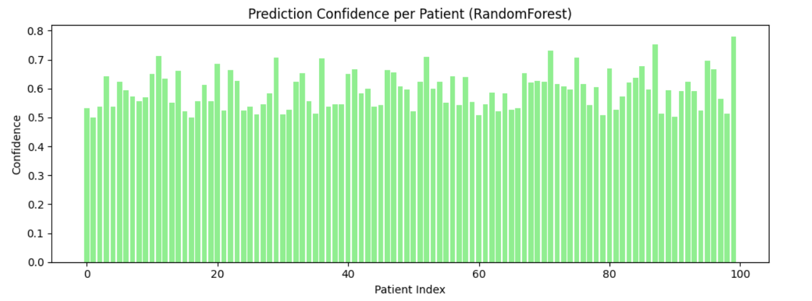

🧬 TheraGuide – AI-Powered Drug Response & Treatment Recommender

TheraGuide is an intelligent machine learning system designed to predict the most effective treatment outcome and personalized drug plan for Typhoid Fever patients, using their clinical, biochemical, and microbiological data.

It integrates AI models (Random Forest & Deep Neural Networks) to analyze patient profiles and recommend optimal therapies, improving precision medicine outcomes.

📖 Overview
Module	Description
🧪 Dataset	Typhoid Fever patient dataset containing demographic, biochemical, and treatment outcome data
🤖 Models	RandomForest Classifier & Deep Neural Network (TensorFlow/Keras)
💊 Output	Predicts treatment outcome + recommends drug plan
📊 Visuals	Accuracy graph, confusion matrix, and prediction distributions
💾 Artifacts	.h5, .pkl, .yaml, .json, .csv, .xlsx exported automatically
⚙️ Folder Structure
Drug Response Detector/
│
├── archive/
│   └── DRP-for-Typhoid-Fever.csv
│
├── theraguide_pipeline.py              # Train + save models
├── visualize_results.py                # Graphs & accuracy plots
├── predict_and_save_results.py         # Prediction generator
├── predict_drug_recommendation.py      # Full drug suggestion engine
│
├── theraguide_model.pkl                # RandomForest model
├── theraguide_model.h5                 # Deep Neural Net model
├── theraguide_metadata.yaml            # Model pipeline summary
│
├── typhoid_drug_predictions.csv        # Final predictions
├── typhoid_drug_predictions.json       # JSON result (for dashboard/API)
├── typhoid_drug_predictions.xlsx       # Excel report
│
├── accuracy_curve.png                  # Training accuracy
├── drug_effectiveness_heatmap.png      # Confusion matrix
└── recommendations.json                # RF inference results

🧩 Dataset

File: DRP-for-Typhoid-Fever.csv
Shape: (500, 13)

Feature Category	Example Columns
🧍 Patient Info	Patient ID, Age, Gender
🧫 Clinical Tests	Hemoglobin, Platelet Count, Calcium, Potassium
🦠 Culture Results	Blood Culture Bacteria, Urine Culture Bacteria
💊 Treatment	Current Medication, Duration
🩺 Target	Treatment Outcome — Good / Moderate / Poor
🧠 Model Workflow
1️⃣ Data Preprocessing

Handles missing values

Label-encodes categorical features

Scales numeric values using StandardScaler

2️⃣ Model Training
Model	Purpose
🌲 RandomForestClassifier	Baseline drug response classifier
🧬 Deep Neural Network (Keras)	Multi-layer predictor capturing nonlinear medical patterns
3️⃣ Evaluation & Visualization

Accuracy Graph (Train vs Validation)

Confusion Matrix Heatmap

True vs Predicted Graphs

Confidence Distribution Plot

4️⃣ Prediction & Recommendation

Predicts response category for each patient

Estimates confidence score

Suggests drug plan based on severity, infection type, and electrolytes

💊 Drug Recommendation Logic
Condition	Recommended Drug Plan
Salmonella detected	Ceftriaxone / Azithromycin
E.coli infection	Ciprofloxacin
Pseudomonas detected	Piperacillin–Tazobactam
Unknown / Other	Broad-spectrum antibiotic (consult doctor)
High severity	+ IV Hydration
Moderate severity	+ Oral Rehydration
Low Calcium (<8.5)	+ Calcium Supplement
Low Potassium (<3.5)	+ Potassium Correction
🧰 Installation
📦 Requirements

Install all dependencies:

pip install numpy pandas scikit-learn tensorflow seaborn matplotlib joblib pyyaml openpyxl

▶️ Usage Guide
1️⃣ Train and Save Models

Run to train models and save .pkl and .h5 files:

python theraguide_pipeline.py

2️⃣ Visualize Performance

Display heatmaps and accuracy graphs:

python visualize_results.py

3️⃣ Generate Predictions and Results

Save results in CSV, JSON, and Excel format:

python predict_and_save_results.py

4️⃣ Drug Recommendation Inference

Generate full predictions + recommended drug plan:

python predict_drug_recommendation.py

📊 Output Example
Patient_ID	True_Outcome	RF_Predicted	RF_Confidence	NN_Predicted	NN_Confidence	Recommended_Drug
P101	Good	Good	0.93	Good	0.91	Ceftriaxone / Azithromycin + Oral Rehydration
P102	Poor	Poor	0.87	Poor	0.89	Ciprofloxacin + IV Hydration
P103	Moderate	Moderate	0.78	Good	0.80	Piperacillin–Tazobactam + Calcium Supplement
P104	Good	Good	0.92	Good	0.94	Broad-spectrum antibiotic + Oral Rehydration

📈 Visual Outputs
Visualization	File	Description
📉 Accuracy Graph	accuracy_curve.png	Neural Net training accuracy over epochs
🔥 Heatmap	drug_effectiveness_heatmap.png	Confusion Matrix
📊 Results Graph	visualize_results.py	True vs Predicted outcomes
📈 Confidence Graph	visualize_results.py	Confidence score per patient
🧾 Key Artifacts
File	Description
theraguide_model.pkl	RandomForest model
theraguide_model.h5	Deep Neural Network
theraguide_metadata.yaml	Pipeline metadata
typhoid_drug_predictions.csv	Final results
typhoid_drug_predictions.json	API-ready JSON output
🚀 Future Enhancements
Feature	Description
🧬 Genomic Data Integration	Include SNP and gene–drug variants
🧠 SHAP / LIME	Explain model decision factors
🧑‍⚕️ Streamlit Dashboard	Interactive drug recommendation UI
🔗 FastAPI Backend	REST API for clinics
🧩 GNN Model	Capture gene–drug–disease relationships
👨‍⚕️ Use Cases
Sector	Application
🏥 Hospitals	Personalized therapy planning
💊 Pharma	Drug response modeling
🧬 Research	Biomarker–drug correlation
🧠 AI in Healthcare	Predicting treatment efficacy
🧑‍💻 Author

Sagnik Patra
AI/ML Engineer · M.Tech in Computer Science (IIIT)
📍 India
🔗 GitHub – sagnik1-patra

💼 Focus: Applied AI, Bioinformatics, Healthcare ML Systems
